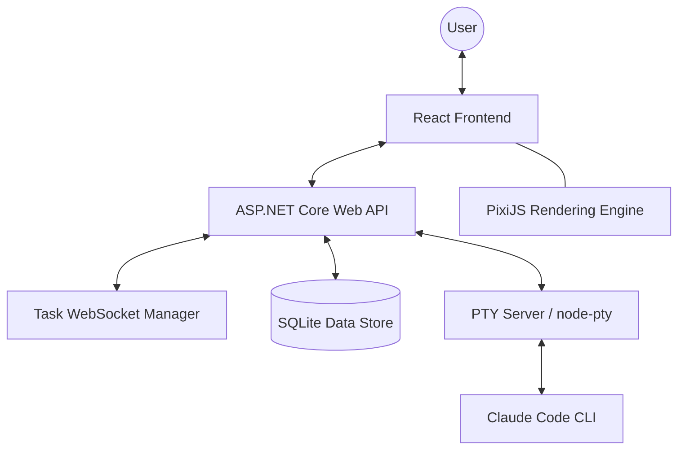
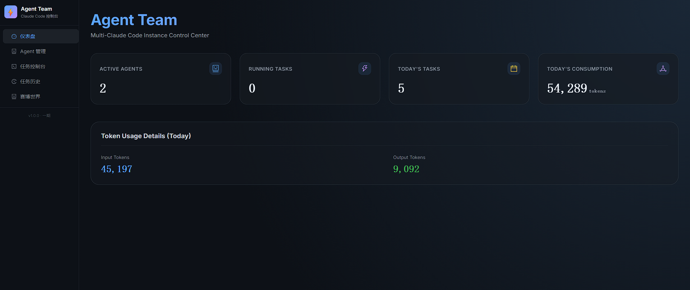
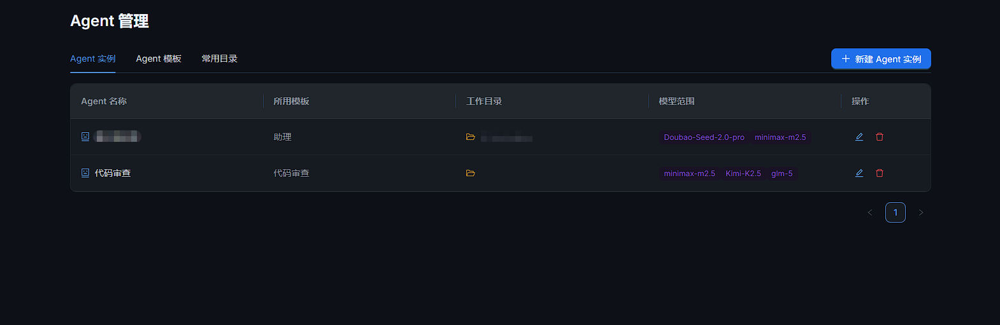
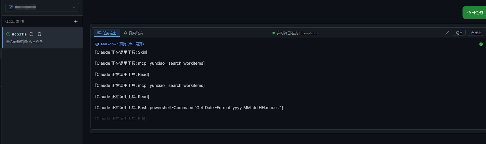
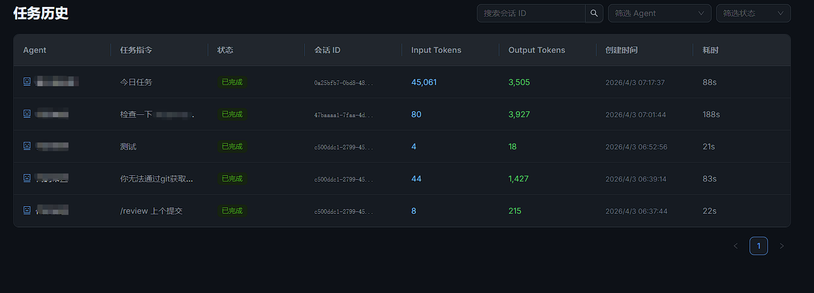
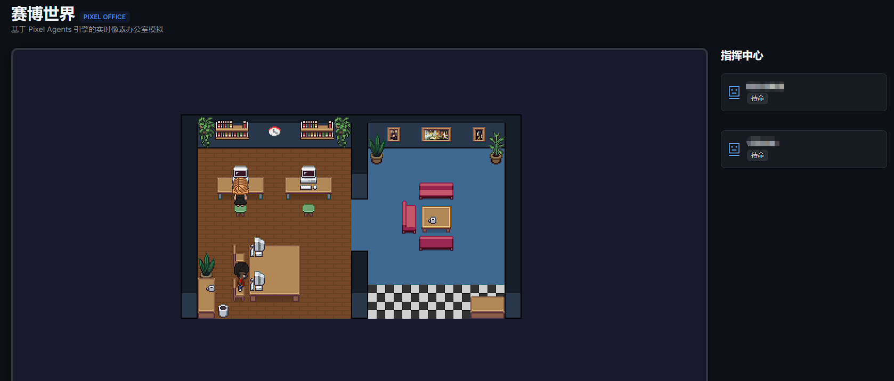

# 🤖 Agent Team — The Cyber Hub for Multiple Claude Code Agents

[中文版 (Chinese README)](README.zh-CN.md) | [](LICENSE)
[](https://dotnet.microsoft.com/)
[](https://react.dev/)
[](https://pixijs.com/)

**Agent Team** is a next-generation Web control platform designed for managing multiple Claude Code instances. It transcends traditional CLI interfaces by combining industrial-grade terminal capabilities with a vibrant **"Cyber World"** virtual office simulation.

---

## 🌟 Key Features

### 1. 📂 Industrial Multi-Agent Management
- **Centralized Control**: Unified dashboard to configure, launch, and monitor multiple Claude Code instances.
- **Environment Isolation**: Specify unique working directories, system prompts, and execution parameters for each agent.
- **Session Persistence**: Seamlessly resume sessions using `session-id` with zero context loss.
- **Config Isolation Strategy**: Forces project-specific `.claude` configuration directories to prevent credential conflicts.

### 2. 🎮 Cyber World — Visual Office Simulation
- **2D Pixel-Art Simulator**: A beautifully rendered Pokémon-style office built with PixiJS.
- **Real-Time Mapping**: Watch as agent actions (working, idling, walking) are instantly reflected by their pixel counterparts.
- **Interactive Environment**: Click agents to jump into their terminal; use right-click to direct their movement.

### 3. ⚡ Ultra-Fast Streaming Console
- **Real-Time WebSocket Sync**: Get millisecond-latency streaming from Claude Code.
- **Modern Chat Interface**: A balanced layout with user prompts on the right and AI terminal outputs on the left.
- **Full PTY Support**: Built on `node-pty`, enabling seamless interaction with TUI tools like `vi`, `grep`, and `less`.

### 4. 🔍 Productivity Enhancements
- **Git Diff & Status**: Integrated Git drawer for visualizing live repository changes and file differences.
- **Deep Multi-Modal Support**: Enhanced images.
- **History Playback**: Full session persistence with logging and historical replay capabilities.
- **Session Kanban**: A visual Kanban board for managing all active sessions across agents at a glance—monitor statuses, view task queues, and jump to any session instantly.

---

## 🏗️ Technical Architecture



### Technology Stack
- **Backend**: ASP.NET Core 10, Entity Framework Core, Custom WebSocket broadcast system.
- **Frontend**: React 18, TypeScript, Vite, Ant Design 5, **PixiJS** (Simulation), **xterm.js** (Terminal).
- **Communication**: REST API + Full-Duplex WebSockets.

---

## 💎 Why Choose Agent Team?

1.  **Intuitive**: Don't just read about your agents—see them! Instantly identify who is working hard and who is taking a break.
2.  **Efficient**: Managing 10 agents feels as effortless as managing one, thanks to centralized monitoring and low-latency feedback.
3.  **Professional**: Retains 100% of Claude Code's native power while adding superior visualization and storage.
4.  **Aesthetics**: A meticulously crafted GitHub Dark theme with smooth animations and charming pixel art.

---

## 📸 Screenshots

### The Modern Cyber Hub & Dashboards


<p align="center">
  
  
</p>
<p align="center">
  
  
</p>

---

## 🚀 Quick Start

### Prerequisites
- Node.js >= 18
- .NET SDK >= 10.0
- Globally installed and logged-in `claude` CLI

### Launch
Run the following from the root directory:
```bat
start-all.bat
```
Then visit:
- **Web Interface**: `http://localhost:5502`
- **Backend API**: `http://localhost:5501`

---

## 📁 Project Structure

- `/frontend`: React application & PixiJS simulation logic.
- `/backend`: High-performance C# API gateway.
- `/pty-server`: Dedicated service for low-level terminal interaction.

---

## 📝 License
This project is licensed under the [MIT](LICENSE) License.
