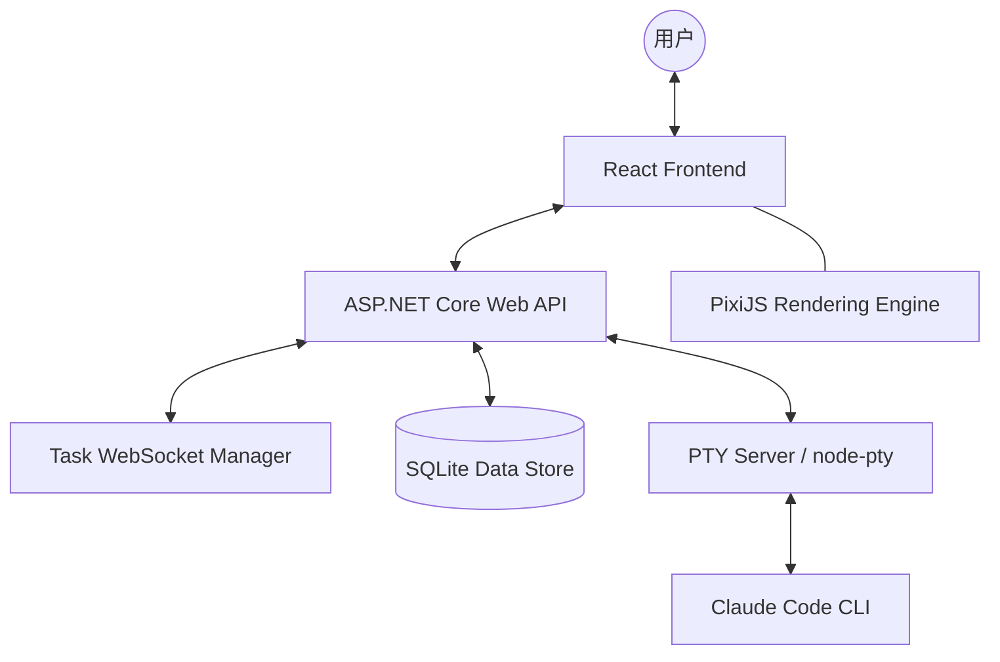

# 🤖 Agent Team — 赛博世界的 Claude Code 多 Agent 管理中枢

[](LICENSE)
[](https://dotnet.microsoft.com/)
[](https://react.dev/)
[](https://pixijs.com/)

**Agent Team** 是一个专为管理多个 Claude Code 实例打造的次世代 Web 控制台。它不仅提供了工业级的终端交互能力，更将 AI 的协作过程具象化为一个生动的「赛博世界」办公模拟器。

---

## 🌟 核心功能

### 1. 📂 工业级多 Agent 管理
- **一站式管控**：统一配置、启动和监控多个 Claude Code 实例。
- **环境隔离**：为每个 Agent 指定独立的工作目录、系统提示词（System Prompt）和执行参数。
- **会话持久化**：基于 `session-id` 自动管理会话上下文，支持跨任务续写。
- **配置隔离策略**：强制每个项目使用独立的 `.claude` 配置目录，解决多项目认证冲突问题。

### 2. 🎮 赛博世界 (Cyber World) — 可视化办公模拟
- **2D 像素风模拟器**：基于 PixiJS 开发的 Pokémon 风格 2d 办公室。
- **实时状态映射**：Agent 的每一个动作（工作中、摸鱼中、移动中）都会实时反映在虚拟小人身上。
- **沉浸式交互**：在办公室中点击 Agent 直接进入对应终端，右键点击可指引 Agent 走位。

### 3. ⚡ 极速流式交互 (Streaming Console)
- **实时输出推送**：通过 WebSocket 实现毫秒级的 Claude 输出同步，告别等待。
- **类微信聊天体验**：左侧 AI 终端输出，右侧用户指令气泡，逻辑清晰。
- **多端 PTY 通讯**：底层采用 node-pty，完美支持 `vi`, `grep` 等 TUI 工具的交互。

### 4. 🔍 辅助增强工具
- **Git 变更可视化**：内置 Git 抽屉组件，实时查看代码变更状态与文件 Diff 差异。
- **多模态深度支持**：支持图片上传。
- **历史记录追踪**：每一份日志都落盘处理，支持历史任务的全量渲染与回放。
- **会话看板**：跨 Agent 全局会话看板，以可视化卡片视图一目了然地掌握所有活跃会话状态，快速跳转任意对话。

---

## 🏗️ 技术架构



### 技术栈详情
- **后端 (Backend)**: ASP.NET Core 10, Entity Framework Core, WebSocket (SignalR 会话管理思想), System.Diagnostics.Process 管理。
- **前端 (Frontend)**: React 18, TypeScript, Vite, Ant Design 5, **PixiJS** (模拟器核心), **xterm.js** (终端渲染)。
- **通讯层**: REST API + 实时双工 WebSocket。

---

## 💎 为什么选择 Agent Team？

1.  **直观性 (Intuitive)**: 不再面对干巴巴的命令行列表，通过「赛博世界」一眼看出你的 AI 团队谁在加班，谁在摸鱼。
2.  **效率 (Efficient)**: 毫秒级的实时反馈和高度集成的 UI，让你管理 10 个 Agent 像管理 1 个一样轻松。
3.  **专业 (Professional)**: 完美保留了 Claude Code 的所有原生能力，并在此基础上提供了更优的展示与存储方案。
4.  **美感 (Aesthetics)**: 精心设计的 GitHub Dark 风格深色主题，配合流畅的打字机动效和像素动画。

---

## 📸 预览 (Screenshots)

### 核心界面: 赛博办公模拟与多 Agent 控制台


<p align="center">
  
  
</p>
<p align="center">
  
  
</p>

---

## 🚀 快速开始

### 前置要求
- Node.js >= 18
- .NET SDK >= 10.0
- 已全局安装并登录 `claude` CLI

### 一键启动
在项目根目录下运行：
```bat
start-all.bat
```
随后访问：
- **Web 界面**: `http://localhost:5502`
- **后端 API/文档**: `http://localhost:5501`

---

## 📁 目录结构

- `/frontend`: 包含 React 应用与 PixiJS 模拟器逻辑。
- `/backend`: 基于 C# 的高性能管理网关。
- `/pty-server`: 处理终端交互的专用服务。

---

## 📝 开源协议
本项目采用 [MIT](LICENSE) 协议。
